# Personal Finance Tracker (Telegram Bot) Architecture Document

**Version:** 1.0  
**Date:** 2025-09-30  
**Status:** Draft

> **📁 This document has been sharded for easier navigation. See [docs/architecture/README.md](./architecture/README.md) for the complete sharded structure.**

---

## Sharded Documents

The architecture documentation is now organized into focused documents:

- **[High-Level Architecture](./architecture/high-level-architecture.md)** - System overview and diagrams
- **[Tech Stack](./architecture/tech-stack.md)** - Technology choices and versions
- **[Coding Standards](./architecture/coding-standards.md)** - Development guidelines
- **[Source Tree](./architecture/source-tree.md)** - Project structure

Additional architecture documents are available in the [architecture directory](./architecture/).

---

## Change Log

| Date | Version | Description | Author |
|------|---------|-------------|--------|
| 2025-09-30 | 1.0 | Initial architecture document | Winston (Architect) |

---

## Introduction

This document outlines the complete system architecture for the **Personal Finance Tracker Telegram Bot**, a conversational AI-powered financial assistant that enables Arabic and English-speaking users to track expenses, income, accounts, and loans through natural language interaction in Telegram.

The architecture leverages a **hybrid serverless approach** combining:
- **Telegram Bot API** for user interaction
- **Convex** as the serverless backend platform (database + functions)
- **Rork Toolkit API** for AI-powered natural language understanding
- **Node.js/TypeScript** for bot server and business logic

This design prioritizes **sub-2-second response times**, **85%+ AI accuracy**, and **zero-friction user experience** while operating within Convex free tier constraints for initial deployment.

### Starter Template or Existing Project

**Status:** Greenfield project - No starter template

This is a new implementation built from scratch. The architecture is optimized for:
- Telegram Bot API integration
- Convex serverless backend
- Rork Toolkit AI integration (not OpenAI/Anthropic)
- Bilingual support (Arabic/English)

---

## High Level Architecture

### Technical Summary

The system implements a **hybrid serverless architecture** where a lightweight Node.js bot server handles Telegram webhook events and delegates all business logic, data operations, and AI processing to Convex serverless functions. The bot server acts as a thin adapter layer between Telegram and Convex, while Convex provides real-time database, serverless compute, and orchestrates calls to the Rork Toolkit API for natural language understanding. This architecture achieves sub-2-second response times through parallel processing, minimizes infrastructure management, and scales automatically within Convex's generous free tier (1M function calls/month). The conversational interface requires no forms or buttons—users interact purely through natural language messages, with AI extracting transaction details and presenting them for confirmation before committing to the database.

### Platform and Infrastructure Choice

**Platform:** Convex + Railway/Render (for bot server)

**Key Services:**
- **Convex**: Serverless backend, real-time database, TypeScript functions, HTTP actions
- **Railway/Render/Fly.io**: Bot server hosting (free tier)
- **Telegram Bot API**: User interface and messaging
- **Rork Toolkit API**: AI/LLM for natural language processing
- **GitHub Actions**: CI/CD pipeline

**Deployment Host and Regions:**
- Convex: Auto-deployed to global edge network
- Bot Server: Single region deployment (US-East or EU-West based on user base)
- Telegram: Global CDN (managed by Telegram)

**Rationale:** This combination provides:
- Zero database management (Convex handles it)
- Automatic scaling and real-time capabilities
- Free tier sufficient for 100-1000 users
- Simple deployment pipeline
- Sub-2-second response times through edge deployment

### Repository Structure

**Structure:** Monorepo with workspace-based organization

**Monorepo Tool:** npm workspaces (lightweight, no additional tooling needed)

**Package Organization:**
```
/bot          - Telegram bot server (Node.js/TypeScript)
/convex       - Convex backend functions and schema
/shared       - Shared TypeScript types and utilities
```

**Rationale:** Simple monorepo structure allows code sharing (especially TypeScript interfaces) between bot and Convex functions while keeping deployment boundaries clear. npm workspaces provide sufficient tooling without complexity of Turborepo/Nx.

### High Level Architecture Diagram

```mermaid
graph TB
    User[👤 User<br/>Telegram Client]
    TG[📱 Telegram Bot API<br/>Webhook/Polling]
    Bot[🤖 Bot Server<br/>Node.js/TypeScript<br/>Railway/Render]
    Convex[⚡ Convex Backend<br/>Serverless Functions<br/>Real-time Database]
    Rork[🧠 Rork Toolkit API<br/>LLM/NLP Service]
    
    User -->|Messages| TG
    TG -->|Webhook Events| Bot
    Bot -->|Convex Client SDK| Convex
    Convex -->|HTTP Actions| Rork
    Convex -->|Responses| Bot
    Bot -->|Messages| TG
    TG -->|Responses| User
    
    subgraph "Data Layer"
        DB[(Convex Database<br/>users, accounts,<br/>transactions, loans)]
    end
    
    Convex --> DB
    
    style User fill:#e1f5ff
    style TG fill:#0088cc
    style Bot fill:#4caf50
    style Convex fill:#ff6b35
    style Rork fill:#9c27b0
    style DB fill:#ffd54f
```



### Architectural Patterns

- **Serverless Architecture:** Convex functions execute on-demand with automatic scaling - _Rationale:_ Zero infrastructure management, pay-per-use pricing, automatic scaling for variable load
- **Event-Driven Architecture:** Telegram webhooks trigger bot server, which invokes Convex functions - _Rationale:_ Loose coupling, asynchronous processing, resilient to failures
- **Adapter Pattern:** Bot server acts as thin adapter between Telegram API and Convex backend - _Rationale:_ Separation of concerns, enables future multi-platform support (WhatsApp, etc.)
- **Repository Pattern:** Convex functions abstract database operations - _Rationale:_ Testable business logic, consistent data access patterns
- **Function Calling Pattern:** Rork AI uses function calling to route user intents to appropriate Convex mutations/queries - _Rationale:_ Structured AI responses, deterministic action execution
- **Confirmation Pattern:** AI extracts intent → Present to user → User confirms → Execute action - _Rationale:_ Prevents errors from AI misinterpretation, builds user trust
- **Optimistic Updates:** Balance updates calculated immediately after transaction confirmation - _Rationale:_ Instant feedback, perceived performance improvement

---

## Tech Stack

### Technology Stack Table

| Category | Technology | Version | Purpose | Rationale |
|----------|-----------|---------|---------|-----------|
| Bot Language | TypeScript | 5.3+ | Bot server development | Type safety, shared types with Convex |
| Bot Framework | node-telegram-bot-api | 0.64+ | Telegram Bot API integration | Mature, well-documented, webhook support |
| Backend Platform | Convex | Latest | Serverless backend + database | Real-time DB, TypeScript functions, free tier |
| Backend Language | TypeScript | 5.3+ | Convex functions | Required by Convex, type safety |
| AI/LLM Provider | Rork Toolkit API | Latest | Natural language understanding | Specified in PRD, function calling support |
| Database | Convex DB | Built-in | User data, transactions, accounts | Integrated with Convex, real-time, no setup |
| Authentication | Telegram User ID | N/A | User identification | Built into Telegram, no separate auth needed |
| Bot Testing | Jest | 29+ | Unit tests for bot logic | Standard Node.js testing |
| Backend Testing | Convex Test | Built-in | Convex function testing | Native Convex testing support |
| E2E Testing | Manual | N/A | AI accuracy validation | AI responses require human validation |
| Build Tool | npm | 9+ | Package management | Standard Node.js tooling |
| Bundler | esbuild | Built-in | Convex function bundling | Included with Convex |
| Bot Deployment | Railway/Render | N/A | Bot server hosting | Free tier, simple deployment |
| Backend Deployment | Convex | N/A | Serverless function hosting | Automatic deployment via CLI |
| CI/CD | GitHub Actions | N/A | Automated testing and deployment | Free for public repos, simple YAML config |
| Monitoring | Convex Dashboard | Built-in | Function logs, performance | Included with Convex |
| Logging | Console + Convex Logs | N/A | Debugging and monitoring | Built-in, sufficient for MVP |
| Environment Config | dotenv | 16+ | Environment variable management | Standard Node.js practice |

---

## Data Models

### User Model

**Purpose:** Represents a Telegram user with their preferences and metadata

**Key Attributes:**
- `telegramUserId`: string (unique) - Telegram user identifier
- `username`: string (optional) - Telegram username
- `firstName`: string - User's first name from Telegram
- `languagePreference`: string - "ar" or "en" for Arabic/English
- `createdAt`: number - Timestamp of user registration

#### TypeScript Interface

```typescript
export interface User {
  _id: Id<"users">;
  _creationTime: number;
  telegramUserId: string;
  username?: string;
  firstName: string;
  languagePreference: "ar" | "en";
  createdAt: number;
}
```

#### Relationships
- One user has many accounts (1:N)
- One user has many transactions (1:N)
- One user has many loans (1:N)

### Account Model

**Purpose:** Represents a financial account (bank, cash, credit card) with current balance

**Key Attributes:**
- `userId`: Id<"users"> - Reference to owning user
- `name`: string - User-defined account name (e.g., "Main Bank")
- `type`: string - "bank" | "cash" | "credit"
- `balance`: number - Current account balance
- `currency`: string - Currency code (default "EGP")
- `isDefault`: boolean - Whether this is the default account for transactions
- `createdAt`: number - Timestamp of account creation

#### TypeScript Interface

```typescript
export interface Account {
  _id: Id<"accounts">;
  _creationTime: number;
  userId: Id<"users">;
  name: string;
  type: "bank" | "cash" | "credit";
  balance: number;
  currency: string;
  isDefault: boolean;
  createdAt: number;
}
```

#### Relationships
- Many accounts belong to one user (N:1)
- One account has many transactions (1:N)

### Transaction Model

**Purpose:** Represents a financial transaction (expense or income)

**Key Attributes:**
- `userId`: Id<"users"> - Reference to owning user
- `accountId`: Id<"accounts"> - Reference to account
- `type`: string - "expense" | "income"
- `amount`: number - Transaction amount (positive number)
- `description`: string - Transaction description
- `category`: string - AI-inferred category (Food, Transport, etc.)
- `date`: number - Transaction date (timestamp)
- `isDeleted`: boolean - Soft delete flag
- `createdAt`: number - Timestamp of transaction creation
- `updatedAt`: number (optional) - Timestamp of last update

#### TypeScript Interface

```typescript
export interface Transaction {
  _id: Id<"transactions">;
  _creationTime: number;
  userId: Id<"users">;
  accountId: Id<"accounts">;
  type: "expense" | "income";
  amount: number;
  description: string;
  category: string;
  date: number;
  isDeleted: boolean;
  createdAt: number;
  updatedAt?: number;
}
```

#### Relationships
- Many transactions belong to one user (N:1)
- Many transactions belong to one account (N:1)

### Loan Model

**Purpose:** Represents money lent to others with tracking of payments

**Key Attributes:**
- `userId`: Id<"users"> - Reference to owning user (lender)
- `borrowerName`: string - Name of person who borrowed money
- `amount`: number - Original loan amount
- `currency`: string - Currency code (default "EGP")
- `dateLent`: number - Timestamp when money was lent
- `status`: string - "active" | "paid"
- `createdAt`: number - Timestamp of loan creation

#### TypeScript Interface

```typescript
export interface Loan {
  _id: Id<"loans">;
  _creationTime: number;
  userId: Id<"users">;
  borrowerName: string;
  amount: number;
  currency: string;
  dateLent: number;
  status: "active" | "paid";
  createdAt: number;
}
```

#### Relationships
- Many loans belong to one user (N:1)
- One loan has many loan payments (1:N)

### Loan Payment Model

**Purpose:** Represents a payment made against a loan

**Key Attributes:**
- `loanId`: Id<"loans"> - Reference to loan
- `amount`: number - Payment amount
- `datePaid`: number - Timestamp of payment
- `createdAt`: number - Timestamp of record creation

#### TypeScript Interface

```typescript
export interface LoanPayment {
  _id: Id<"loan_payments">;
  _creationTime: number;
  loanId: Id<"loans">;
  amount: number;
  datePaid: number;
  createdAt: number;
}
```

#### Relationships
- Many loan payments belong to one loan (N:1)

---

## API Specification

### Convex Functions API

The system uses **Convex queries, mutations, and actions** instead of traditional REST/GraphQL. The bot server calls these functions via the Convex Client SDK.

#### Function Categories

**Queries** (read-only, cached):
- `users.getOrCreateUser(telegramUserId, userData)` - Get or create user profile
- `accounts.getUserAccounts(userId)` - Get all accounts for user
- `accounts.getDefaultAccount(userId)` - Get user's default account
- `transactions.getRecentTransactions(userId, limit)` - Get recent transactions
- `transactions.getTransactionsByDateRange(userId, startDate, endDate)` - Filter transactions
- `transactions.searchTransactions(userId, searchTerm)` - Search transactions by description
- `loans.getUserLoans(userId, status)` - Get loans (filtered by status)
- `loans.getLoanDetails(loanId)` - Get loan with payment history
- `loans.getLoanPayments(loanId)` - Get all payments for a loan

**Mutations** (write operations, transactional):
- `accounts.createAccount(userId, name, type, initialBalance)` - Create new account
- `accounts.setDefaultAccount(userId, accountId)` - Set default account
- `accounts.updateAccountBalance(accountId, newBalance)` - Manual balance adjustment
- `transactions.createTransaction(userId, accountId, type, amount, description, category)` - Log transaction
- `transactions.updateTransaction(transactionId, updates)` - Edit transaction
- `transactions.deleteTransaction(transactionId)` - Soft delete transaction
- `loans.createLoan(userId, borrowerName, amount, dateLent)` - Create loan record
- `loans.recordPayment(loanId, amount, datePaid)` - Record loan payment
- `loans.markLoanAsPaid(loanId)` - Manually close loan

**Actions** (can call external APIs):
- `ai.processUserMessage(userId, message, context)` - Send message to Rork API and extract intent
- `ai.categorizeTransaction(description)` - Get AI category suggestion
- `ai.extractTransactionDetails(message)` - Parse transaction from natural language

#### Example Function Signatures

```typescript
// convex/users.ts
export const getOrCreateUser = mutation({
  args: {
    telegramUserId: v.string(),
    username: v.optional(v.string()),
    firstName: v.string(),
    languagePreference: v.union(v.literal("ar"), v.literal("en")),
  },
  handler: async (ctx, args) => {
    // Implementation
  },
});

// convex/transactions.ts
export const createTransaction = mutation({
  args: {
    userId: v.id("users"),
    accountId: v.id("accounts"),
    type: v.union(v.literal("expense"), v.literal("income")),
    amount: v.number(),
    description: v.string(),
    category: v.string(),
  },
  handler: async (ctx, args) => {
    // Implementation
  },
});

// convex/ai.ts
export const processUserMessage = action({
  args: {
    userId: v.id("users"),
    message: v.string(),
    context: v.optional(v.any()),
  },
  handler: async (ctx, args) => {
    // Call Rork API
    // Return structured intent
  },
});
```

---

## Components

### Telegram Bot Server

**Responsibility:** Receives Telegram webhook events, routes to appropriate handlers, calls Convex functions, sends responses back to Telegram

**Key Interfaces:**
- Telegram Bot API (incoming webhooks)
- Convex Client SDK (outgoing function calls)

**Dependencies:** 
- `node-telegram-bot-api` for Telegram integration
- `convex` client SDK for backend communication

**Technology Stack:** Node.js, TypeScript, Express (for webhook endpoint)

**Key Files:**
- `bot/src/index.ts` - Main bot server entry point
- `bot/src/handlers/` - Message and command handlers
- `bot/src/services/convex.ts` - Convex client wrapper
- `bot/src/utils/telegram.ts` - Telegram formatting utilities

### Convex Backend Functions

**Responsibility:** Execute business logic, manage database operations, orchestrate AI calls, enforce data validation and security

**Key Interfaces:**
- Convex queries/mutations/actions (called by bot server)
- Rork Toolkit API (called from actions)
- Convex database (internal)

**Dependencies:**
- Convex runtime
- Rork Toolkit API client

**Technology Stack:** TypeScript, Convex framework

**Key Files:**
- `convex/schema.ts` - Database schema definitions
- `convex/users.ts` - User management functions
- `convex/accounts.ts` - Account management functions
- `convex/transactions.ts` - Transaction management functions
- `convex/loans.ts` - Loan management functions
- `convex/ai.ts` - AI integration actions

### Rork AI Integration Layer

**Responsibility:** Translate natural language user messages into structured intents and extract transaction details

**Key Interfaces:**
- Rork Toolkit API `/text/llm/` endpoint
- Function calling protocol for intent routing

**Dependencies:**
- Rork Toolkit API credentials
- System prompts for financial domain

**Technology Stack:** HTTP client (fetch), TypeScript

**Key Files:**
- `convex/ai.ts` - Rork API client and prompt management
- `convex/prompts/` - System prompts for different intents

### Database Layer (Convex DB)

**Responsibility:** Store and retrieve user data with real-time capabilities and transactional consistency

**Key Interfaces:**
- Convex query/mutation context (`ctx.db`)

**Dependencies:** None (managed by Convex)

**Technology Stack:** Convex built-in database (document-based with indexes)

**Schema Tables:**
- `users` - User profiles
- `accounts` - Financial accounts
- `transactions` - Expense/income records
- `loans` - Loan tracking
- `loan_payments` - Loan payment history

### Component Diagram


---

## External APIs

### Rork Toolkit API

- **Purpose:** Natural language understanding, intent extraction, transaction categorization
- **Documentation:** https://toolkit.rork.com (assumed - verify with user)
- **Base URL(s):** `https://toolkit.rork.com`
- **Authentication:** API Key (from `config.api.json` or environment variables)
- **Rate Limits:** 60 requests/minute (recommended), max 5 concurrent

**Key Endpoints Used:**
- `POST /text/llm/` - Send user message and receive AI response with function calling

**Integration Notes:**
- Implement retry logic with exponential backoff (3 retries, 1s initial delay)
- Timeout set to 5 seconds per request
- Use function calling to get structured responses (intent + extracted entities)
- System prompt defines bot personality and capabilities
- Include conversation context for multi-turn interactions

**Example Request:**
```json
{
  "model": "default",
  "messages": [
    {
      "role": "system",
      "content": "You are a financial assistant. Extract transaction details from user messages."
    },
    {
      "role": "user",
      "content": "دفعت 50 جنيه على القهوة"
    }
  ],
  "functions": [
    {
      "name": "log_expense",
      "description": "Log an expense transaction",
      "parameters": {
        "type": "object",
        "properties": {
          "amount": {"type": "number"},
          "description": {"type": "string"},
          "category": {"type": "string"}
        }
      }
    }
  ]
}
```

### Telegram Bot API

- **Purpose:** Send and receive messages, handle user interactions
- **Documentation:** https://core.telegram.org/bots/api
- **Base URL(s):** `https://api.telegram.org/bot<token>/`
- **Authentication:** Bot token (from BotFather)
- **Rate Limits:** 30 messages/second per bot

**Key Endpoints Used:**
- `POST /sendMessage` - Send text messages to users
- `POST /setWebhook` - Configure webhook URL for receiving updates
- `POST /getUpdates` - Polling mode (alternative to webhooks)

**Integration Notes:**
- Use webhook mode for production (lower latency than polling)
- Implement message queue if rate limit approached
- Use Telegram markdown for formatting (bold, italic, code)
- Handle long messages (split if > 4096 characters)

---

## Core Workflows

### Expense Logging Workflow

```mermaid
sequenceDiagram
    actor User
    participant TG as Telegram
    participant Bot as Bot Server
    participant Convex as Convex Functions
    participant Rork as Rork AI
    participant DB as Database

    User->>TG: "دفعت 50 على القهوة"
    TG->>Bot: Webhook: message event
    Bot->>Convex: ai.processUserMessage(userId, message)
    Convex->>Rork: POST /text/llm/ (with function calling)
    Rork-->>Convex: {intent: "log_expense", amount: 50, description: "coffee", category: "Food"}
    Convex-->>Bot: Extracted transaction details
    Bot->>TG: "💸 Expense: 50 EGP for 'coffee' (Food) from Main Bank. Confirm?"
    TG->>User: Display confirmation
    User->>TG: "yes" / "نعم"
    TG->>Bot: Webhook: confirmation message
    Bot->>Convex: transactions.createTransaction(userId, accountId, ...)
    Convex->>DB: Insert transaction
    Convex->>DB: Update account balance
    DB-->>Convex: Success
    Convex-->>Bot: {success: true, newBalance: 2950}
    Bot->>TG: "✅ Logged! New balance: 2950 EGP"
    TG->>User: Display confirmation
```



### Loan Payment Tracking Workflow

```mermaid
sequenceDiagram
    actor User
    participant TG as Telegram
    participant Bot as Bot Server
    participant Convex as Convex Functions
    participant DB as Database

    User->>TG: "Ahmed paid 200"
    TG->>Bot: Webhook: message event
    Bot->>Convex: ai.processUserMessage(userId, message)
    Convex->>Convex: Extract: borrower="Ahmed", amount=200
    Convex->>DB: Query active loans for "Ahmed"
    DB-->>Convex: Loan found (500 EGP)
    Convex-->>Bot: {intent: "loan_payment", loanId, amount: 200}
    Bot->>TG: "Ahmed paid 200 EGP toward 500 EGP loan?"
    TG->>User: Display confirmation
    User->>TG: "yes"
    TG->>Bot: Webhook: confirmation
    Bot->>Convex: loans.recordPayment(loanId, 200)
    Convex->>DB: Insert loan_payment record
    Convex->>DB: Calculate remaining balance (300)
    DB-->>Convex: Success
    Convex-->>Bot: {success: true, remaining: 300}
    Bot->>TG: "✅ Payment recorded! Ahmed now owes 300 EGP"
    TG->>User: Display confirmation
```



### Balance Check Workflow

```mermaid
sequenceDiagram
    actor User
    participant TG as Telegram
    participant Bot as Bot Server
    participant Convex as Convex Functions
    participant DB as Database

    User->>TG: "what's my balance?"
    TG->>Bot: Webhook: message event
    Bot->>Convex: ai.processUserMessage(userId, message)
    Convex-->>Bot: {intent: "check_balance"}
    Bot->>Convex: accounts.getUserAccounts(userId)
    Convex->>DB: Query accounts
    DB-->>Convex: [Account1, Account2, ...]
    Convex-->>Bot: Accounts with balances
    Bot->>TG: "💰 Main Bank: 2950 EGP\n🏦 Savings: 10000 EGP\nTotal: 12950 EGP"
    TG->>User: Display balances
```



---

## Database Schema

### Convex Schema Definition

```typescript
// convex/schema.ts
import { defineSchema, defineTable } from "convex/server";
import { v } from "convex/values";

export default defineSchema({
  users: defineTable({
    telegramUserId: v.string(),
    username: v.optional(v.string()),
    firstName: v.string(),
    languagePreference: v.union(v.literal("ar"), v.literal("en")),
    createdAt: v.number(),
  })
    .index("by_telegram_id", ["telegramUserId"]),

  accounts: defineTable({
    userId: v.id("users"),
    name: v.string(),
    type: v.union(v.literal("bank"), v.literal("cash"), v.literal("credit")),
    balance: v.number(),
    currency: v.string(),
    isDefault: v.boolean(),
    createdAt: v.number(),
  })
    .index("by_user", ["userId"])
    .index("by_user_default", ["userId", "isDefault"]),

  transactions: defineTable({
    userId: v.id("users"),
    accountId: v.id("accounts"),
    type: v.union(v.literal("expense"), v.literal("income")),
    amount: v.number(),
    description: v.string(),
    category: v.string(),
    date: v.number(),
    isDeleted: v.boolean(),
    createdAt: v.number(),
    updatedAt: v.optional(v.number()),
  })
    .index("by_user", ["userId"])
    .index("by_account", ["accountId"])
    .index("by_user_date", ["userId", "date"])
    .index("by_user_not_deleted", ["userId", "isDeleted"]),

  loans: defineTable({
    userId: v.id("users"),
    borrowerName: v.string(),
    amount: v.number(),
    currency: v.string(),
    dateLent: v.number(),
    status: v.union(v.literal("active"), v.literal("paid")),
    createdAt: v.number(),
  })
    .index("by_user", ["userId"])
    .index("by_user_status", ["userId", "status"])
    .index("by_borrower", ["userId", "borrowerName"]),

  loan_payments: defineTable({
    loanId: v.id("loans"),
    amount: v.number(),
    datePaid: v.number(),
    createdAt: v.number(),
  })
    .index("by_loan", ["loanId"]),
});
```

### Index Strategy

**Performance Considerations:**
- `by_telegram_id` on users: Fast user lookup on every message (most frequent query)
- `by_user_default` on accounts: Instant default account retrieval for transactions
- `by_user_date` on transactions: Efficient date range queries for history
- `by_user_not_deleted` on transactions: Filter deleted transactions without full scan
- `by_user_status` on loans: Quick active loan queries
- `by_loan` on loan_payments: Fast payment history retrieval

**Scalability:**
- Convex automatically shards data across nodes
- Indexes maintained automatically
- Query performance remains constant up to 10,000+ transactions per user

---

## Backend Architecture

### Service Architecture - Serverless Functions

#### Function Organization

```
convex/
├── schema.ts                 # Database schema definition
├── users.ts                  # User management functions
├── accounts.ts               # Account CRUD operations
├── transactions.ts           # Transaction management
├── loans.ts                  # Loan tracking functions
├── ai.ts                     # Rork API integration
├── lib/
│   ├── rork.ts              # Rork API client
│   ├── validation.ts        # Input validation utilities
│   └── calculations.ts      # Balance calculation logic
└── prompts/
    ├── system.ts            # System prompts for AI
    └── functions.ts         # Function calling definitions
```

#### Function Template Example

```typescript
// convex/transactions.ts
import { mutation, query } from "./_generated/server";
import { v } from "convex/values";

export const createTransaction = mutation({
  args: {
    userId: v.id("users"),
    accountId: v.id("accounts"),
    type: v.union(v.literal("expense"), v.literal("income")),
    amount: v.number(),
    description: v.string(),
    category: v.string(),
  },
  handler: async (ctx, args) => {
    // Validate amount is positive
    if (args.amount <= 0) {
      throw new Error("Amount must be positive");
    }

    // Verify account belongs to user
    const account = await ctx.db.get(args.accountId);
    if (!account || account.userId !== args.userId) {
      throw new Error("Invalid account");
    }

    // Create transaction
    const transactionId = await ctx.db.insert("transactions", {
      ...args,
      date: Date.now(),
      isDeleted: false,
      createdAt: Date.now(),
    });

    // Update account balance
    const balanceChange = args.type === "expense" ? -args.amount : args.amount;
    await ctx.db.patch(args.accountId, {
      balance: account.balance + balanceChange,
    });

    return {
      transactionId,
      newBalance: account.balance + balanceChange,
    };
  },
});

export const getRecentTransactions = query({
  args: {
    userId: v.id("users"),
    limit: v.optional(v.number()),
  },
  handler: async (ctx, args) => {
    const limit = args.limit ?? 20;
    
    const transactions = await ctx.db
      .query("transactions")
      .withIndex("by_user_not_deleted", (q) =>
        q.eq("userId", args.userId).eq("isDeleted", false)
      )
      .order("desc")
      .take(limit);

    return transactions;
  },
});
```

### Database Architecture

#### Data Access Layer Pattern

```typescript
// convex/lib/repositories/accountRepository.ts
import { DatabaseReader, DatabaseWriter } from "./_generated/server";
import { Id } from "./_generated/dataModel";

export class AccountRepository {
  constructor(private db: DatabaseReader | DatabaseWriter) {}

  async getDefaultAccount(userId: Id<"users">) {
    return await this.db
      .query("accounts")
      .withIndex("by_user_default", (q) =>
        q.eq("userId", userId).eq("isDefault", true)
      )
      .first();
  }

  async setDefaultAccount(userId: Id<"users">, accountId: Id<"accounts">) {
    // Remove default flag from all accounts
    const accounts = await this.db
      .query("accounts")
      .withIndex("by_user", (q) => q.eq("userId", userId))
      .collect();

    for (const account of accounts) {
      if (account.isDefault) {
        await (this.db as DatabaseWriter).patch(account._id, {
          isDefault: false,
        });
      }
    }

    // Set new default
    await (this.db as DatabaseWriter).patch(accountId, {
      isDefault: true,
    });
  }
}
```

### Authentication and Authorization

#### Auth Flow


#### Middleware/Guards

```typescript
// convex/lib/auth.ts
import { QueryCtx, MutationCtx } from "./_generated/server";
import { Id } from "./_generated/dataModel";

export async function requireUser(
  ctx: QueryCtx | MutationCtx,
  userId: Id<"users">
) {
  const user = await ctx.db.get(userId);
  if (!user) {
    throw new Error("User not found");
  }
  return user;
}

export async function requireAccountOwnership(
  ctx: QueryCtx | MutationCtx,
  userId: Id<"users">,
  accountId: Id<"accounts">
) {
  const account = await ctx.db.get(accountId);
  if (!account || account.userId !== userId) {
    throw new Error("Unauthorized: Account does not belong to user");
  }
  return account;
}

// Usage in functions:
export const updateAccountBalance = mutation({
  args: {
    userId: v.id("users"),
    accountId: v.id("accounts"),
    newBalance: v.number(),
  },
  handler: async (ctx, args) => {
    await requireUser(ctx, args.userId);
    await requireAccountOwnership(ctx, args.userId, args.accountId);
    
    // Proceed with update
    await ctx.db.patch(args.accountId, {
      balance: args.newBalance,
    });
  },
});
```

---

## Bot Server Architecture

### Bot Server Structure

```
bot/
├── src/
│   ├── index.ts                    # Main entry point
│   ├── bot.ts                      # Telegram bot initialization
│   ├── config/
│   │   ├── env.ts                  # Environment variable loading
│   │   └── convex.ts               # Convex client setup
│   ├── handlers/
│   │   ├── commands.ts             # /start, /help commands
│   │   ├── messages.ts             # Natural language message handling
│   │   └── callbacks.ts            # Callback query handling (if needed)
│   ├── services/
│   │   ├── convex.ts               # Convex function call wrappers
│   │   └── session.ts              # In-memory session management
│   ├── utils/
│   │   ├── telegram.ts             # Telegram formatting utilities
│   │   ├── language.ts             # Arabic/English detection
│   │   └── logger.ts               # Logging utilities
│   └── types/
│       └── index.ts                # TypeScript type definitions
├── tests/
│   └── handlers.test.ts            # Unit tests
├── .env.example                    # Environment template
├── package.json
└── tsconfig.json
```

### Bot Server Entry Point

```typescript
// bot/src/index.ts
import express from "express";
import TelegramBot from "node-telegram-bot-api";
import { config } from "./config/env";
import { setupHandlers } from "./handlers";
import { logger } from "./utils/logger";

const app = express();
const bot = new TelegramBot(config.telegramBotToken, { polling: false });

// Webhook endpoint
app.use(express.json());
app.post(`/webhook/${config.telegramBotToken}`, (req, res) => {
  bot.processUpdate(req.body);
  res.sendStatus(200);
});

// Health check
app.get("/health", (req, res) => {
  res.json({ status: "ok", timestamp: Date.now() });
});

// Setup message handlers
setupHandlers(bot);

// Start server
const PORT = process.env.PORT || 3000;
app.listen(PORT, async () => {
  logger.info(`Bot server listening on port ${PORT}`);
  
  // Set webhook
  const webhookUrl = `${config.webhookUrl}/webhook/${config.telegramBotToken}`;
  await bot.setWebHook(webhookUrl);
  logger.info(`Webhook set to ${webhookUrl}`);
});
```

### Message Handler Example

```typescript
// bot/src/handlers/messages.ts
import TelegramBot from "node-telegram-bot-api";
import { convexClient } from "../services/convex";
import { sessionManager } from "../services/session";
import { detectLanguage } from "../utils/language";
import { api } from "../../convex/_generated/api";

export function setupMessageHandlers(bot: TelegramBot) {
  bot.on("message", async (msg) => {
    if (msg.text?.startsWith("/")) return; // Skip commands

    const telegramUserId = msg.from!.id.toString();
    const messageText = msg.text || "";

    try {
      // Get or create user
      const userId = await convexClient.mutation(api.users.getOrCreateUser, {
        telegramUserId,
        username: msg.from?.username,
        firstName: msg.from?.first_name || "User",
        languagePreference: detectLanguage(messageText),
      });

      // Check for pending confirmation
      const session = sessionManager.getSession(telegramUserId);
      if (session?.pendingConfirmation) {
        await handleConfirmation(bot, msg, userId, session);
        return;
      }

      // Process message with AI
      const result = await convexClient.action(api.ai.processUserMessage, {
        userId,
        message: messageText,
        context: session?.context,
      });

      // Handle different intents
      switch (result.intent) {
        case "log_expense":
          await handleExpenseIntent(bot, msg, userId, result);
          break;
        case "check_balance":
          await handleBalanceIntent(bot, msg, userId);
          break;
        case "list_loans":
          await handleLoansIntent(bot, msg, userId);
          break;
        default:
          await bot.sendMessage(msg.chat.id, "I didn't understand that. Try /help for examples.");
      }
    } catch (error) {
      logger.error("Error processing message:", error);
      await bot.sendMessage(
        msg.chat.id,
        "Sorry, something went wrong. Please try again."
      );
    }
  });
}

async function handleExpenseIntent(
  bot: TelegramBot,
  msg: TelegramBot.Message,
  userId: string,
  result: any
) {
  const { amount, description, category, accountId } = result.extracted;

  // Get account name for confirmation
  const account = await convexClient.query(api.accounts.getAccount, {
    accountId,
  });

  const confirmationMessage = 
    `💸 Expense: ${amount} EGP for '${description}' (${category}) from ${account.name}.\n\nConfirm? (yes/no)`;

  await bot.sendMessage(msg.chat.id, confirmationMessage);

  // Store pending confirmation in session
  sessionManager.setSession(msg.from!.id.toString(), {
    pendingConfirmation: {
      type: "expense",
      data: { userId, accountId, amount, description, category },
    },
  });
}
```

---

## Unified Project Structure

```
finance-tracker-telegram-bot/
├── .github/                          # CI/CD workflows
│   └── workflows/
│       ├── ci.yaml                   # Run tests on PR
│       └── deploy.yaml               # Deploy bot + Convex
├── bot/                              # Telegram bot server
│   ├── src/
│   │   ├── index.ts                  # Express server + webhook
│   │   ├── bot.ts                    # Telegram bot setup
│   │   ├── config/
│   │   │   ├── env.ts                # Environment config
│   │   │   └── convex.ts             # Convex client
│   │   ├── handlers/
│   │   │   ├── commands.ts           # /start, /help
│   │   │   ├── messages.ts           # Natural language handling
│   │   │   └── callbacks.ts          # Callback queries
│   │   ├── services/
│   │   │   ├── convex.ts             # Convex wrappers
│   │   │   └── session.ts            # Session management
│   │   ├── utils/
│   │   │   ├── telegram.ts           # Formatting utilities
│   │   │   ├── language.ts           # Language detection
│   │   │   └── logger.ts             # Logging
│   │   └── types/
│   │       └── index.ts              # Type definitions
│   ├── tests/
│   │   └── handlers.test.ts          # Unit tests
│   ├── .env.example
│   ├── package.json
│   └── tsconfig.json
├── convex/                           # Convex backend
│   ├── schema.ts                     # Database schema
│   ├── users.ts                      # User functions
│   ├── accounts.ts                   # Account functions
│   ├── transactions.ts               # Transaction functions
│   ├── loans.ts                      # Loan functions
│   ├── ai.ts                         # AI integration actions
│   ├── lib/
│   │   ├── rork.ts                   # Rork API client
│   │   ├── validation.ts             # Input validation
│   │   ├── calculations.ts           # Balance calculations
│   │   └── repositories/             # Data access patterns
│   │       ├── accountRepository.ts
│   │       └── transactionRepository.ts
│   ├── prompts/
│   │   ├── system.ts                 # System prompts
│   │   └── functions.ts              # Function calling defs
│   └── _generated/                   # Convex generated files
├── shared/                           # Shared types/utilities
│   ├── src/
│   │   ├── types/
│   │   │   ├── user.ts               # User types
│   │   │   ├── account.ts            # Account types
│   │   │   ├── transaction.ts        # Transaction types
│   │   │   └── loan.ts               # Loan types
│   │   ├── constants/
│   │   │   ├── categories.ts         # Transaction categories
│   │   │   └── currencies.ts         # Currency codes
│   │   └── utils/
│   │       └── formatters.ts         # Shared formatting
│   └── package.json
├── docs/                             # Documentation
│   ├── prd.md                        # Product requirements
│   ├── architecture.md               # This document
│   └── api-reference.md              # API documentation
├── scripts/                          # Build/deploy scripts
│   ├── setup.sh                      # Initial setup
│   └── deploy.sh                     # Deployment script
├── .env.example                      # Environment template
├── .gitignore
├── package.json                      # Root package.json (workspaces)
├── config.api.json                   # Rork API configuration
└── README.md
```

---

## Development Workflow

### Local Development Setup

#### Prerequisites

```bash
# Install Node.js 18+
node --version  # Should be 18.x or higher

# Install npm 9+
npm --version   # Should be 9.x or higher

# Install Convex CLI globally
npm install -g convex
```

#### Initial Setup

```bash
# Clone repository
git clone <repo-url>
cd finance-tracker-telegram-bot

# Install dependencies (all workspaces)
npm install

# Setup environment variables
cp .env.example .env
# Edit .env with your credentials:
# - TELEGRAM_BOT_TOKEN (from BotFather)
# - RORK_API_KEY (from Rork Toolkit)
# - CONVEX_DEPLOYMENT (from Convex dashboard)

# Initialize Convex project
cd convex
npx convex dev  # This will create a new Convex project

# In another terminal, start bot server
cd bot
npm run dev
```

#### Development Commands

```bash
# Start all services (from root)
npm run dev

# Start Convex only
cd convex && npx convex dev

# Start bot server only
cd bot && npm run dev

# Run tests
npm test                    # All tests
npm test --workspace=bot    # Bot tests only
npm test --workspace=convex # Convex tests only

# Lint and format
npm run lint
npm run format

# Build for production
npm run build
```

### Environment Configuration

#### Required Environment Variables

```bash
# Bot Server (.env in /bot)
TELEGRAM_BOT_TOKEN=<your-bot-token>
CONVEX_URL=<convex-deployment-url>
WEBHOOK_URL=<your-bot-server-url>  # e.g., https://your-app.railway.app
PORT=3000
NODE_ENV=development

# Convex (.env.local in /convex)
RORK_API_KEY=<your-rork-api-key>
RORK_BASE_URL=https://toolkit.rork.com

# Shared (both)
LOG_LEVEL=info
```

---

## Deployment Architecture

### Deployment Strategy

**Bot Server Deployment:**
- **Platform:** Railway (recommended) or Render
- **Build Command:** `npm run build --workspace=bot`
- **Start Command:** `node bot/dist/index.js`
- **Environment:** Node.js 18+
- **Health Check:** `GET /health`
- **Auto-scaling:** Not needed for MVP (single instance sufficient)

**Convex Deployment:**
- **Platform:** Convex Cloud (automatic)
- **Build Command:** `npx convex deploy` (runs automatically)
- **Deployment Method:** Push to production via Convex CLI
- **Environment:** Managed by Convex
- **Regions:** Global edge network (automatic)

### CI/CD Pipeline

```yaml
# .github/workflows/deploy.yaml
name: Deploy

on:
  push:
    branches: [main]

jobs:
  test:
    runs-on: ubuntu-latest
    steps:
      - uses: actions/checkout@v3
      - uses: actions/setup-node@v3
        with:
          node-version: 18
      - run: npm ci
      - run: npm test

  deploy-convex:
    needs: test
    runs-on: ubuntu-latest
    steps:
      - uses: actions/checkout@v3
      - uses: actions/setup-node@v3
        with:
          node-version: 18
      - run: npm ci
      - run: npx convex deploy --prod
        env:
          CONVEX_DEPLOY_KEY: ${{ secrets.CONVEX_DEPLOY_KEY }}

  deploy-bot:
    needs: test
    runs-on: ubuntu-latest
    steps:
      - uses: actions/checkout@v3
      - uses: actions/setup-node@v3
        with:
          node-version: 18
      - run: npm ci
      - run: npm run build --workspace=bot
      - name: Deploy to Railway
        run: |
          npm install -g @railway/cli
          railway up --service bot
        env:
          RAILWAY_TOKEN: ${{ secrets.RAILWAY_TOKEN }}
```

### Environments

| Environment | Bot Server URL | Convex Deployment | Purpose |
|-------------|----------------|-------------------|---------|
| Development | http://localhost:3000 | Local dev deployment | Local development and testing |
| Staging | https://staging-bot.railway.app | Staging deployment | Pre-production testing with real Telegram |
| Production | https://bot.railway.app | Production deployment | Live environment for users |

---

## Security and Performance

### Security Requirements

**Bot Server Security:**
- **Webhook Validation:** Verify Telegram webhook signature (optional but recommended)
- **Rate Limiting:** Implement per-user rate limits (10 messages/minute) to prevent spam
- **Input Sanitization:** Sanitize all user inputs before passing to Convex
- **Environment Variables:** Never commit secrets; use platform secret management
- **HTTPS Only:** Enforce HTTPS for webhook endpoint

**Convex Security:**
- **Data Isolation:** All queries filtered by userId to prevent cross-user data access
- **Input Validation:** Validate all function arguments using Convex validators
- **API Key Protection:** Store Rork API key in Convex environment variables
- **No Direct Database Access:** Users cannot query database directly (only through functions)

**Authentication Security:**
- **Telegram User ID:** Trust Telegram's user authentication (verified by Telegram servers)
- **Session Management:** In-memory sessions (no sensitive data stored)
- **No Password Storage:** No passwords needed (Telegram handles auth)

### Performance Optimization

**Bot Server Performance:**
- **Response Time Target:** < 500ms for webhook acknowledgment
- **Async Processing:** Acknowledge webhook immediately, process in background
- **Connection Pooling:** Reuse Convex client connections
- **Caching:** Cache user language preference in-memory

**Convex Performance:**
- **Response Time Target:** < 1 second for queries, < 2 seconds for mutations
- **Database Optimization:** Use indexes for all frequent queries
- **Parallel Queries:** Fetch related data in parallel when possible
- **Caching Strategy:** Convex automatically caches query results

**AI Performance:**
- **Rork API Timeout:** 5 seconds max per request
- **Retry Strategy:** 3 retries with exponential backoff (1s, 2s, 4s)
- **Concurrent Limit:** Max 5 concurrent AI requests
- **Fallback:** If AI fails, prompt user to rephrase

---

## Testing Strategy

### Testing Pyramid

```
        E2E Tests (Manual)
       /                  \
      Integration Tests
     /                    \
    Bot Unit Tests    Convex Unit Tests
```

**Rationale:** Heavy emphasis on unit tests for business logic, integration tests for critical flows, manual E2E for AI accuracy validation.

### Test Organization

#### Bot Tests

```
bot/tests/
├── handlers/
│   ├── commands.test.ts          # Test /start, /help commands
│   └── messages.test.ts          # Test message routing
├── services/
│   ├── convex.test.ts            # Test Convex client wrappers
│   └── session.test.ts           # Test session management
└── utils/
    ├── language.test.ts          # Test language detection
    └── telegram.test.ts          # Test formatting utilities
```

#### Convex Tests

```
convex/tests/
├── users.test.ts                 # Test user functions
├── accounts.test.ts              # Test account CRUD
├── transactions.test.ts          # Test transaction logic
├── loans.test.ts                 # Test loan tracking
└── lib/
    ├── validation.test.ts        # Test input validation
    └── calculations.test.ts      # Test balance calculations
```

#### E2E Tests (Manual)

```
Manual test scenarios:
1. New user onboarding flow
2. Expense logging in Arabic and English
3. Multi-account transaction handling
4. Loan creation and payment tracking
5. Transaction history and search
6. AI accuracy on diverse inputs
```

### Test Examples

#### Bot Unit Test

```typescript
// bot/tests/handlers/messages.test.ts
import { describe, it, expect, vi } from "vitest";
import { handleExpenseIntent } from "../../src/handlers/messages";

describe("handleExpenseIntent", () => {
  it("should send confirmation message with correct format", async () => {
    const mockBot = {
      sendMessage: vi.fn(),
    };
    const mockMsg = {
      chat: { id: 123 },
      from: { id: 456 },
    };
    const mockResult = {
      extracted: {
        amount: 50,
        description: "coffee",
        category: "Food",
        accountId: "account123",
      },
    };

    await handleExpenseIntent(mockBot as any, mockMsg as any, "user123", mockResult);

    expect(mockBot.sendMessage).toHaveBeenCalledWith(
      123,
      expect.stringContaining("💸 Expense: 50 EGP")
    );
  });
});
```

#### Convex Unit Test

```typescript
// convex/tests/transactions.test.ts
import { convexTest } from "convex-test";
import { expect, test } from "vitest";
import schema from "../schema";
import { createTransaction } from "../transactions";

test("createTransaction updates account balance", async () => {
  const t = convexTest(schema);

  // Setup: Create user and account
  const userId = await t.run(async (ctx) => {
    return await ctx.db.insert("users", {
      telegramUserId: "123",
      firstName: "Test",
      languagePreference: "en",
      createdAt: Date.now(),
    });
  });

  const accountId = await t.run(async (ctx) => {
    return await ctx.db.insert("accounts", {
      userId,
      name: "Test Account",
      type: "cash",
      balance: 1000,
      currency: "EGP",
      isDefault: true,
      createdAt: Date.now(),
    });
  });

  // Test: Create expense transaction
  const result = await t.mutation(createTransaction, {
    userId,
    accountId,
    type: "expense",
    amount: 50,
    description: "coffee",
    category: "Food",
  });

  // Assert: Balance decreased
  expect(result.newBalance).toBe(950);

  // Verify database state
  const account = await t.run(async (ctx) => {
    return await ctx.db.get(accountId);
  });
  expect(account?.balance).toBe(950);
});
```

---

## Coding Standards

### Critical Fullstack Rules

- **Type Safety:** All Convex functions must use strict TypeScript validators (`v.string()`, `v.number()`, etc.) - no `v.any()` except for AI responses
- **User Isolation:** Every query/mutation must filter by `userId` - never expose data across users
- **Error Messages:** Return user-friendly error messages in both Arabic and English based on user's language preference
- **Balance Consistency:** Always update account balance in the same transaction as creating/updating/deleting a transaction record
- **Soft Deletes:** Never physically delete transactions or loans - use `isDeleted` flag for audit trail
- **AI Confirmation:** Always present AI-extracted data to user for confirmation before committing to database
- **Rate Limiting:** Implement rate limiting on bot server to prevent spam (10 messages/minute per user)
- **Logging:** Log all AI API calls with request/response for debugging and accuracy measurement

### Naming Conventions

| Element | Convention | Example |
|---------|-----------|---------|
| Convex Functions | camelCase | `createTransaction`, `getUserAccounts` |
| Convex Tables | snake_case (plural) | `users`, `loan_payments` |
| TypeScript Interfaces | PascalCase | `User`, `Transaction`, `LoanPayment` |
| Bot Handlers | camelCase with 'handle' prefix | `handleExpenseIntent`, `handleConfirmation` |
| Environment Variables | UPPER_SNAKE_CASE | `TELEGRAM_BOT_TOKEN`, `RORK_API_KEY` |
| File Names | camelCase for code, kebab-case for config | `transactions.ts`, `config.api.json` |

---

## Error Handling Strategy

### Error Flow


### Error Response Format

```typescript
// shared/src/types/error.ts
export interface AppError {
  code: string;
  message: string;
  details?: Record<string, any>;
  timestamp: number;
  userMessage: {
    en: string;
    ar: string;
  };
}

// Error codes
export enum ErrorCode {
  AI_TIMEOUT = "AI_TIMEOUT",
  AI_RATE_LIMIT = "AI_RATE_LIMIT",
  INVALID_AMOUNT = "INVALID_AMOUNT",
  ACCOUNT_NOT_FOUND = "ACCOUNT_NOT_FOUND",
  UNAUTHORIZED = "UNAUTHORIZED",
  VALIDATION_ERROR = "VALIDATION_ERROR",
}
```

### Bot Error Handling

```typescript
// bot/src/utils/errorHandler.ts
import { AppError, ErrorCode } from "../../../shared/src/types/error";

export function handleError(error: any, language: "ar" | "en"): string {
  // Known application errors
  if (error.code && error.userMessage) {
    return error.userMessage[language];
  }

  // Convex errors
  if (error.message?.includes("Unauthorized")) {
    return language === "ar"
      ? "عذراً، لا يمكنك الوصول إلى هذا الحساب"
      : "Sorry, you cannot access this account";
  }

  // Generic error
  return language === "ar"
    ? "حدث خطأ. يرجى المحاولة مرة أخرى"
    : "Something went wrong. Please try again";
}
```

### Convex Error Handling

```typescript
// convex/lib/errors.ts
import { ErrorCode } from "../../shared/src/types/error";

export class AppError extends Error {
  constructor(
    public code: ErrorCode,
    public userMessage: { en: string; ar: string },
    public details?: Record<string, any>
  ) {
    super(userMessage.en);
    this.name = "AppError";
  }
}

export function throwInvalidAmount() {
  throw new AppError(
    ErrorCode.INVALID_AMOUNT,
    {
      en: "Amount must be a positive number",
      ar: "يجب أن يكون المبلغ رقماً موجباً",
    }
  );
}

export function throwAccountNotFound() {
  throw new AppError(
    ErrorCode.ACCOUNT_NOT_FOUND,
    {
      en: "Account not found",
      ar: "الحساب غير موجود",
    }
  );
}

// Usage in Convex functions:
export const createTransaction = mutation({
  args: { /* ... */ },
  handler: async (ctx, args) => {
    if (args.amount <= 0) {
      throwInvalidAmount();
    }
    
    const account = await ctx.db.get(args.accountId);
    if (!account) {
      throwAccountNotFound();
    }
    
    // Proceed with transaction
  },
});
```

---

## Monitoring and Observability

### Monitoring Stack

- **Bot Server Monitoring:** Railway/Render built-in metrics (CPU, memory, request count)
- **Convex Monitoring:** Convex Dashboard (function execution time, error rate, database queries)
- **Error Tracking:** Console logs + Convex logs (sufficient for MVP, upgrade to Sentry post-MVP)
- **Performance Monitoring:** Custom logging of AI response times and end-to-end latency

### Key Metrics to Track

**Bot Server Metrics:**
- Webhook response time (target: < 500ms)
- Message processing rate (messages/minute)
- Error rate (target: < 1%)
- Memory usage (target: < 512MB)

**Convex Metrics:**
- Function execution time (target: < 1s for queries, < 2s for mutations)
- AI API call latency (target: < 2s)
- Database query performance (target: < 100ms)
- Error rate by function (target: < 1%)

**Business Metrics:**
- Daily active users (DAU)
- Transactions logged per user per day
- AI categorization accuracy (manual sampling)
- User retention (7-day, 30-day)

### Logging Strategy

```typescript
// bot/src/utils/logger.ts
import winston from "winston";

export const logger = winston.createLogger({
  level: process.env.LOG_LEVEL || "info",
  format: winston.format.combine(
    winston.format.timestamp(),
    winston.format.json()
  ),
  transports: [
    new winston.transports.Console(),
    // Add file transport for production
  ],
});

// Usage:
logger.info("Processing message", {
  userId,
  messageLength: message.length,
  language: detectedLanguage,
});

logger.error("AI API call failed", {
  userId,
  error: error.message,
  retryCount,
});
```

```typescript
// convex/lib/logger.ts
export function logAICall(
  userId: string,
  message: string,
  response: any,
  latency: number
) {
  console.log(JSON.stringify({
    type: "ai_call",
    userId,
    messageLength: message.length,
    responseIntent: response.intent,
    latencyMs: latency,
    timestamp: Date.now(),
  }));
}

// Usage in Convex actions:
export const processUserMessage = action({
  handler: async (ctx, args) => {
    const startTime = Date.now();
    const response = await callRorkAPI(args.message);
    const latency = Date.now() - startTime;
    
    logAICall(args.userId, args.message, response, latency);
    
    return response;
  },
});
```

---

## Next Steps

### For Development Team

1. **Setup Development Environment:**
   - Create Telegram bot via BotFather
   - Setup Convex project (`npx convex dev`)
   - Obtain Rork Toolkit API credentials
   - Configure environment variables

2. **Implement Core Infrastructure:**
   - Convex schema and database setup
   - Bot server with webhook handling
   - Convex client integration
   - Basic command handlers (/start, /help)

3. **Integrate AI Layer:**
   - Rork API client implementation
   - System prompts and function calling definitions
   - Intent extraction and entity parsing
   - Confirmation flow implementation

4. **Build Feature Modules:**
   - Follow epic order from PRD (Foundation → Accounts → Transactions → Loans → History)
   - Implement Convex functions first, then bot handlers
   - Test each module before moving to next

5. **Testing and Deployment:**
   - Write unit tests for critical business logic
   - Manual testing with diverse Arabic/English inputs
   - Setup CI/CD pipeline
   - Deploy to staging environment
   - User acceptance testing
   - Production deployment

### For Product Team

- Review architecture alignment with PRD requirements
- Validate NFRs can be achieved with this architecture
- Approve technology choices and platform selection
- Define success metrics and monitoring dashboards

### For QA Team

- Review testing strategy and coverage
- Prepare test data sets (diverse Arabic/English inputs)
- Define AI accuracy measurement methodology
- Create manual test scenarios for E2E validation

---

**Document Status:** Ready for review and approval

**Next Document:** Coding Standards (detailed) - to be created in `docs/architecture/coding-standards.md`

**Architecture Review Meeting:** Schedule with Product, Dev, and QA teams
