# High-Level Architecture

**Version:** 1.0  
**Date:** 2025-09-30

---

## Introduction

This document outlines the complete system architecture for the **Personal Finance Tracker Telegram Bot**, a conversational AI-powered financial assistant that enables Arabic and English-speaking users to track expenses, income, accounts, and loans through natural language interaction in Telegram.

The architecture leverages a **hybrid serverless approach** combining:
- **Telegram Bot API** for user interaction
- **Convex** as the serverless backend platform (database + functions)
- **Rork Toolkit API** for AI-powered natural language understanding
- **Node.js/TypeScript** for bot server and business logic

This design prioritizes **sub-2-second response times**, **85%+ AI accuracy**, and **zero-friction user experience** while operating within Convex free tier constraints for initial deployment.

---

## Starter Template or Existing Project

**Status:** Greenfield project - No starter template

This is a new implementation built from scratch. The architecture is optimized for:
- Telegram Bot API integration
- Convex serverless backend
- Rork Toolkit AI integration (not OpenAI/Anthropic)
- Bilingual support (Arabic/English)

---

## Technical Summary

The system implements a **hybrid serverless architecture** where a lightweight Node.js bot server handles Telegram webhook events and delegates all business logic, data operations, and AI processing to Convex serverless functions. The bot server acts as a thin adapter layer between Telegram and Convex, while Convex provides real-time database, serverless compute, and orchestrates calls to the Rork Toolkit API for natural language understanding. This architecture achieves sub-2-second response times through parallel processing, minimizes infrastructure management, and scales automatically within Convex's generous free tier (1M function calls/month). The conversational interface requires no forms or buttons—users interact purely through natural language messages, with AI extracting transaction details and presenting them for confirmation before committing to the database.

---

## Platform and Infrastructure Choice

**Platform:** Convex + Railway/Render (for bot server)

**Key Services:**
- **Convex**: Serverless backend, real-time database, TypeScript functions, HTTP actions
- **Railway/Render/Fly.io**: Bot server hosting (free tier)
- **Telegram Bot API**: User interface and messaging
- **Rork Toolkit API**: AI/LLM for natural language processing
- **GitHub Actions**: CI/CD pipeline

**Deployment Host and Regions:**
- Convex: Auto-deployed to global edge network
- Bot Server: Single region deployment (US-East or EU-West based on user base)
- Telegram: Global CDN (managed by Telegram)

**Rationale:** This combination provides:
- Zero database management (Convex handles it)
- Automatic scaling and real-time capabilities
- Free tier sufficient for 100-1000 users
- Simple deployment pipeline
- Sub-2-second response times through edge deployment

---

## Repository Structure

**Structure:** Monorepo with workspace-based organization

**Monorepo Tool:** npm workspaces (lightweight, no additional tooling needed)

**Package Organization:**
```
/bot          - Telegram bot server (Node.js/TypeScript)
/convex       - Convex backend functions and schema
/shared       - Shared TypeScript types and utilities
```

**Rationale:** Simple monorepo structure allows code sharing (especially TypeScript interfaces) between bot and Convex functions while keeping deployment boundaries clear. npm workspaces provide sufficient tooling without complexity of Turborepo/Nx.

---

## High-Level Architecture Diagram

```mermaid
graph TB
    User[👤 User<br/>Telegram Client]
    TG[📱 Telegram Bot API<br/>Webhook/Polling]
    Bot[🤖 Bot Server<br/>Node.js/TypeScript<br/>Railway/Render]
    Convex[⚡ Convex Backend<br/>Serverless Functions<br/>Real-time Database]
    Rork[🧠 Rork Toolkit API<br/>LLM/NLP Service]
    
    User -->|Messages| TG
    TG -->|Webhook Events| Bot
    Bot -->|Convex Client SDK| Convex
    Convex -->|HTTP Actions| Rork
    Convex -->|Responses| Bot
    Bot -->|Messages| TG
    TG -->|Responses| User
    
    subgraph "Data Layer"
        DB[(Convex Database<br/>users, accounts,<br/>transactions, loans)]
    end
    
    Convex --> DB
    
    style User fill:#e1f5ff
    style TG fill:#0088cc
    style Bot fill:#4caf50
    style Convex fill:#ff6b35
    style Rork fill:#9c27b0
    style DB fill:#ffd54f
```



---

## Architectural Patterns

- **Serverless Architecture:** Convex functions execute on-demand with automatic scaling - _Rationale:_ Zero infrastructure management, pay-per-use pricing, automatic scaling for variable load
- **Event-Driven Architecture:** Telegram webhooks trigger bot server, which invokes Convex functions - _Rationale:_ Loose coupling, asynchronous processing, resilient to failures
- **Adapter Pattern:** Bot server acts as thin adapter between Telegram API and Convex backend - _Rationale:_ Separation of concerns, enables future multi-platform support (WhatsApp, etc.)
- **Repository Pattern:** Convex functions abstract database operations - _Rationale:_ Testable business logic, consistent data access patterns
- **Function Calling Pattern:** Rork AI uses function calling to route user intents to appropriate Convex mutations/queries - _Rationale:_ Structured AI responses, deterministic action execution
- **Confirmation Pattern:** AI extracts intent → Present to user → User confirms → Execute action - _Rationale:_ Prevents errors from AI misinterpretation, builds user trust
- **Optimistic Updates:** Balance updates calculated immediately after transaction confirmation - _Rationale:_ Instant feedback, perceived performance improvement

---

**Related Documents:**
- [Tech Stack](./tech-stack.md)
- [Components](./components.md)
- [Data Models](./data-models.md)
- [Workflows](./workflows.md)
