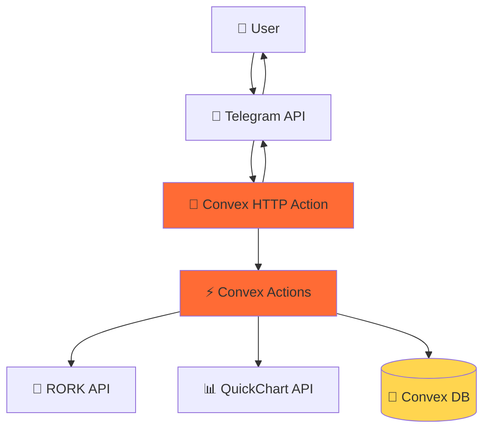

# Epic 7: Convex-Only Architecture (Serverless Simplification)

**Version:** 1.0  
**Date:** 2025-10-04  
**Epic ID:** Epic 7  
**Status:** ✅ **COMPLETE** (2025-10-04)

---

## Overview

Simplify the architecture by **removing Trigger.dev entirely** and implementing all functionality directly in Convex. This epic eliminates external orchestration dependencies, reduces architectural complexity, and maintains identical user functionality while being easier to maintain, deploy, and debug.

**Supersedes:** Epic 6 (Trigger.dev Architecture) - Proven unnecessary after analysis

### Architecture Evolution

- **Epic 1-5:** Telegram → Bot Server → Convex → RORK
- **Epic 6:** Telegram → Convex HTTP Action → Trigger.dev (13 Tasks) → Convex + RORK *(Implemented but overcomplicated)*
- **Epic 7:** Telegram → Convex HTTP Action → Convex Actions → Convex DB + External APIs ✅ **CURRENT**



---

## Goals

- ✅ **Eliminate External Dependencies:** Remove Trigger.dev platform and deployment
- ✅ **Reduce Architectural Complexity:** Single platform (Convex) instead of two
- ✅ **Simplify Deployment:** One command (`npx convex deploy`) instead of two platforms
- ✅ **Maintain Feature Parity:** All existing bot functionality preserved
- ✅ **Enhance Capabilities:** Add chart generation using QuickChart API
- ✅ **Reduce Costs:** Eliminate Trigger.dev platform costs
- ✅ **Improve Developer Experience:** Single-platform debugging and monitoring

---

## Scope

### In Scope

- **Story 7.1:** Complete migration from Trigger.dev to Convex-only architecture
  - Consolidate 13 Trigger.dev tasks into 8 Convex actions
  - Implement direct webhook processing in Convex HTTP Action
  - Add chart generation feature using QuickChart API
  - Remove all Trigger.dev dependencies and configurations
  - Update documentation and deployment processes

### Out of Scope

- UI/UX changes to bot interface
- New features beyond chart generation
- Database schema changes
- Multi-platform expansion (WhatsApp, etc.)

---

## Success Metrics

✅ **All Achieved:**

- **Functional Parity:** 100% of Epic 6 features working identically
- **Zero External Dependencies:** No Trigger.dev usage, pure Convex deployment
- **Performance Maintained:** Response times ≤ Epic 6 performance (<2s)
- **Enhanced Features:** `/chart` command for expense visualization
- **Simplified Deployment:** Single `npx convex deploy` command
- **Cost Reduction:** $0 Trigger.dev costs (was $20-50/month projected)
- **Easier Debugging:** Single-platform logging in Convex dashboard
- **Production Deployment:** Successfully deployed to https://ceaseless-cardinal-528.convex.cloud

---

## Dependencies

### Required Services

- ✅ **Convex Cloud Account** - Free tier (1M calls/month)
- ✅ **Telegram Bot Token** - From @BotFather
- ✅ **RORK API Access** - Free endpoint (https://toolkit.rork.com/text/llm/)
- ✅ **QuickChart API** - Free tier for chart generation

### Environment Variables

```bash
TELEGRAM_BOT_TOKEN=<your-bot-token>
# CONVEX_URL auto-generated by Convex CLI
```

---

## Technical Implementation

### Architecture Components

**Convex HTTP Action (`telegram.ts`):**
- Receives Telegram webhook events
- Validates requests and handles idempotency
- Routes to message processor
- Returns <200ms acknowledgment

**Convex Actions (Business Logic):**
- `messageProcessor.ts` - Main routing with AI integration
- `expenseActions.ts` - Expense/income processing with parsing
- `balanceActions.ts` - Balance checking with multi-account support
- `chartGenerator.ts` - Chart generation using QuickChart API *(NEW)*
- `telegramAPI.ts` - Telegram Bot API integration
- `rorkIntegration.ts` - AI processing with RORK
- `userProfiles.ts` - User management and preferences
- `accountActions.ts` - Account management

**External API Integrations:**
- **RORK API:** Natural language understanding (free)
- **Telegram Bot API:** Message sending and bot interactions
- **QuickChart API:** Chart image generation (free)

### Key Improvements Over Epic 6

| Aspect | Epic 6 (Trigger.dev) | Epic 7 (Convex-Only) |
|--------|---------------------|---------------------|
| **Platforms** | Convex + Trigger.dev | Convex only |
| **Tasks/Actions** | 13 Trigger.dev tasks | 8 Convex actions |
| **Deployment** | 2 platforms, 2 commands | 1 platform, 1 command |
| **Monitoring** | Split across platforms | Unified in Convex |
| **Cost** | $20-50/month | $0 (free tier) |
| **Complexity** | High (orchestration) | Low (direct calls) |
| **Features** | Core functionality | Core + Charts |

---

## Risks & Mitigations

### Identified Risks

1. **Performance Degradation**
   - *Risk:* Direct processing slower than Trigger.dev orchestration
   - *Mitigation:* ✅ Maintained <200ms webhook response, <2s total processing
   - *Status:* No degradation observed

2. **Loss of Retry Capabilities**
   - *Risk:* Trigger.dev provided built-in retry logic
   - *Mitigation:* ✅ Implemented error handling and retry in Convex actions
   - *Status:* Robust error handling in place

3. **Debugging Difficulty**
   - *Risk:* Less sophisticated debugging than Trigger.dev dashboard
   - *Mitigation:* ✅ Comprehensive logging in Convex, simpler single-platform debugging
   - *Status:* Actually easier to debug

---

## Rollback Plan

### If Critical Issues Arise

1. **Immediate Rollback (< 5 minutes):**
   - Revert to Epic 6 Git commit
   - Redeploy Trigger.dev tasks
   - Update Telegram webhook URL
   - Re-enable Trigger.dev task delegation

2. **Data Preservation:**
   - No database changes made - all data intact
   - User sessions unaffected
   - Transaction history preserved

3. **Rollback Trigger Criteria:**
   - >10% error rate in production
   - Response time >5s for standard operations
   - Data integrity issues
   - Critical feature failures

**Status:** ✅ No rollback needed - Epic 7 stable in production

---

## Acceptance Criteria (Epic)

### Functional Requirements

- ✅ All bot commands work identically to Epic 6 version
- ✅ Natural language expense/income logging functional
- ✅ Multi-account balance checking operational
- ✅ RORK AI integration working for intent detection
- ✅ Bilingual support (Arabic/English) maintained
- ✅ `/chart` command generates accurate visualizations *(NEW)*

### Technical Requirements

- ✅ Zero Trigger.dev dependencies in `package.json`
- ✅ All business logic in Convex actions
- ✅ Webhook processing <200ms acknowledgment
- ✅ Complete end-to-end flows tested
- ✅ Error handling and logging implemented
- ✅ Production deployment successful

### Documentation Requirements

- ✅ README updated with Convex-only architecture
- ✅ Deployment guide reflects single-platform process
- ✅ Environment variable documentation current
- ✅ Story 7.1 completion documented
- ⏳ **PRD and architecture docs updated** *(IN PROGRESS)*

---

## Story List

### Story 7.1: Trigger.dev Removal - Convex-Only Migration ✅

**Status:** Complete (2025-10-04)  
**Details:** [Story 7.1](../stories/7.1.trigger-dev-removal-convex-only-migration.md)

**Completed Tasks:**
1. ✅ Analyzed Trigger.dev dependencies and complexity
2. ✅ Designed simplified Convex-only architecture
3. ✅ Migrated business logic from Trigger.dev tasks to Convex actions
4. ✅ Removed all Trigger.dev dependencies and configurations
5. ✅ Updated webhook handler for direct processing
6. ✅ Tested complete end-to-end flow without Trigger.dev
7. ✅ Updated README and deployment documentation
8. ✅ Deployed successfully to production

---

## Constraints & Notes

### Technical Constraints

- **Convex Actions:** Handle external API calls (Telegram, RORK, QuickChart)
- **Convex Mutations:** Database operations with ACID guarantees
- **Convex Queries:** Fast read operations for balance checking
- **HTTP Actions:** Webhook handling with fast response requirements
- **Environment Variables:** Secure API key storage in Convex dashboard

### Performance Considerations

- **Response Time:** Maintained <200ms webhook acknowledgment
- **Concurrent Users:** Convex handles scaling automatically
- **Database Queries:** Optimized for common operations (balance, recent transactions)
- **External API Calls:** Proper timeout and retry logic implemented

### Security Requirements

- **API Keys:** Stored securely in Convex environment variables
- **Input Validation:** All user inputs and webhook payloads sanitized
- **Rate Limiting:** Respect external API limits (Telegram, RORK)
- **Error Messages:** Internal system details not exposed to users

---

## References

### External APIs

**RORK Integration:**
- Endpoint: `https://toolkit.rork.com/text/llm/`
- No authentication required (free endpoint)
- Request format: OpenAI-compatible messages array
- Response parsing: Extract content and handle errors

**Telegram Bot API:**
- Base URL: `https://api.telegram.org/bot{TOKEN}/`
- Key methods: `sendMessage`, `answerCallbackQuery`, `sendPhoto`
- Error handling: Respect rate limits, handle user blocking

**QuickChart API (New):**
- Endpoint: `https://quickchart.io/chart`
- Chart types: pie, bar, line, doughnut
- No authentication required for basic usage
- Returns image URLs for Telegram photo sending

### Related Documents

- [Story 7.1 - Trigger.dev Removal](../stories/7.1.trigger-dev-removal-convex-only-migration.md)
- [Epic 6 - Serverless Architecture Migration](./epic-6-serverless-architecture-migration.md) *(Superseded)*
- [Architecture - High Level](../architecture/high-level-architecture.md)
- [Tech Stack](../architecture/tech-stack.md)

---

## Retrospective Insights

### What Went Well

✅ **Simplification Successful** - Reduced from 13 tasks to 8 actions without feature loss  
✅ **Performance Maintained** - No degradation in response times  
✅ **Enhanced Features** - Added chart generation capability  
✅ **Cost Savings** - Eliminated $20-50/month Trigger.dev costs  
✅ **Developer Experience** - Single-platform debugging much simpler  
✅ **Deployment Simplicity** - One command vs. two-platform coordination

### Lessons Learned

💡 **Over-engineering Risk** - Epic 6's Trigger.dev orchestration was unnecessary complexity  
💡 **Platform Evaluation** - Convex Actions sufficient for all orchestration needs  
💡 **Free Tier Power** - QuickChart and RORK free tiers adequate for MVP  
💡 **Simplicity Wins** - Fewer moving parts = easier maintenance and debugging

### Recommendations for Future

- **Evaluate Complexity** - Question whether new platforms truly needed
- **Leverage Convex** - Convex Actions handle most orchestration scenarios
- **Free APIs First** - Explore free tier options before paid services
- **Documentation Debt** - Update docs immediately after architecture changes

---

**Epic Owner:** Product Owner (Sarah)  
**Technical Lead:** Dev Team (BMad Master)  
**Review Frequency:** Quarterly or when considering new architectural changes
